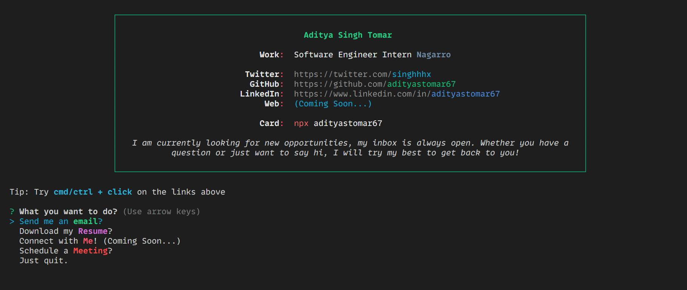

# 🏆  Npx Business Card

Basically a terminal based portfolio. (for nerds 🤓).

## 👨‍💻 Run my business card

```bash
npx adityastomar67
```

If you wish to reuse it, you can easily update the links in the `personal-info.json` file (the script will read from there 😄).

If you edit the script on your machine, you will have to run `npm link` to locally _symlink_ the package, and then run `pH7BioLinks` in your terminal.

## 👨‍🍳 The Coder

Me, I'm **[Aditya Singh Tomar](https://github.com/adityastomar67/)**, a programmatic and passionate software developer who enjoys challenges and continuous learning on a daily basis! 👨‍🏭

You can reach me at _hi {{AT}} adityastomar67 [[D0T]] me_! ...Coming very soooon!!!



## 👀 Heavily inspired by ...

This script was heavily inspired by [@natterstefan](https://github.com/natterstefan)'s NPM business card package.
